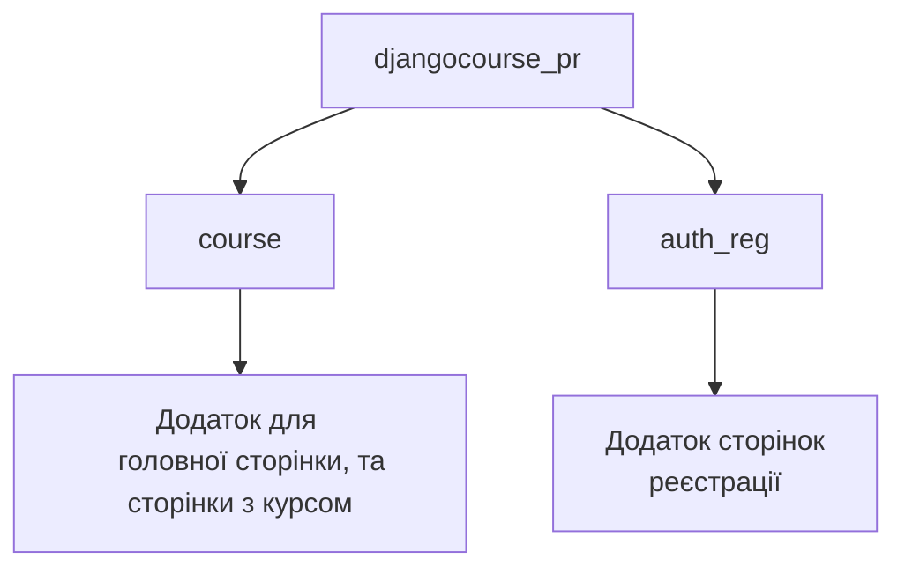
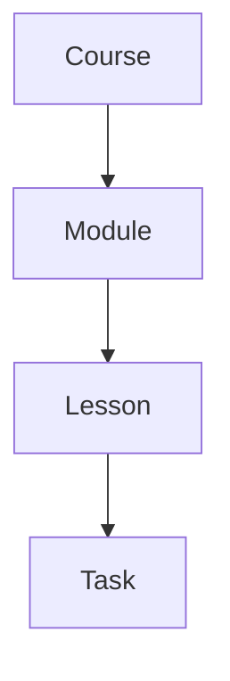
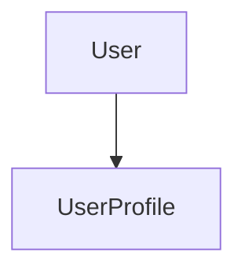

# Course Project - Проект курсу для навчання


## Опис проекту

Цей проект є курсом для навчання студентів та створенням уроків і завдань з боку вчителів. Вчителі мають зручний інтерфейс для створення модулів, уроків та завдань для учнів, а учні можуть швидко проходити створені завдання. 

Головною перевагою проекту є масштабне використання технології AJAX, завдяки чому майже всі операції — заповнення, створення, видалення та проходження завдань — виконуються швидко та без оновлення сторінок

## Зміст
- [Встановлення](#встановлення-та-запуск)
- [Використання можливостей акаунтів](#використання-можливостей-акаунтів)
- [Сторінки проекту](#сторінки-проекту)
- [Використані технології](#використані-технології)
- [Структура проекту](#структура-проекту)
- [Функціонал проекту](#функціонал-проекту)
- [FRONTEND](#frontend)
- [BACKEND](#backend)
- [МОДЕЛІ ПРОЕКТУ](#моделі-проекту)
- [Плани подальшого розвитку проекту](#плани-подальшого-розвитку-проекту)

## Встановлення та запуск
### Якщо Django встановлений
#### 1. Клонування репозиторію
```
git clone https://github.com/FeliksNovoselskyi/course-tasks-practice.git
```
#### 2. Перехід до головної директорії проекту з файлом ```manage.py```
```
cd djangocourse_pr
```
#### 3. Встановіть необхідні бібліотеки для створення завданнь
```
pip install pandas
```
```
pip install openpyxl
```
#### 4. Запуск локального серверу
Для Windows
```
python manage.py runserver
```
Для MacOS/Linux
```
python3 manage.py runserver
```

### Якщо Django НЕ встановлений
#### 1. Встановіть Django
```
pip install django
```

#### 2. Клонування репозиторію
```
git clone https://github.com/FeliksNovoselskyi/course-tasks-practice.git
```
#### 3. Перехід до головної директорії проекту з файлом ```manage.py```
```
cd djangocourse_pr
```
#### 4. Встановіть необхідні бібліотеки для створення завданнь
```
pip install pandas
```
```
pip install openpyxl
```
#### 5. Запуск локального серверу
Для Windows
```
python manage.py runserver
```
Для MacOS/Linux
```
python3 manage.py runserver
```
## Використання можливостей акаунтів
#### Для того щоб використати можливості вчителя
1. Перейдіть на сторінку авторизації
2. Увійдіть в акаунт з іменем ```testteacher``` та паролем ```123456```
3. Перейдіть на сторінку курсу, та користуйтесь

#### Для того щоб використати можливості студента
1. Перейдіть на сторінку авторизації
2. Після цього, перейдіть на сторінку реєстрації
3. Створіть акаунт, він з самого початку буде акаунтом студента
4. Увійдіть в свій акаунт

## Сторінки проекту
- **Головна сторінка** - головна сторінка проекту з інформацією про платформу (поки що пуста сторінка)
- **Сторінка курсу** - сторінка яка надає можливість вчителям заповнювати курс модулями, уроками та завданнями, а студентам їх виконувати
- **Сторінки авторизації та реєстрації** - на цих сторінках ви можете створити свій акаунт на сайті, та увійти в нього

## Використані технології

- **[Python](https://www.python.org/)** — мова програмування, використана для створення backend частини сайту
- **[Django](https://docs.djangoproject.com/en/5.0/)** — веб-фреймворк, на якому створений проект
- **[JavaScript](https://developer.mozilla.org/en-US/docs/Web/JavaScript)** — основна мова програмування, що покращує користувацький інтерфейс
- **[jQuery](https://jquery.com/)** — бібліотека JavaScript, що спрощує розробку та користування проектом
- **[Sortable](https://jqueryui.com/sortable/)** — плагін jQuery для зручного сортування уроків та модулів, а також зміни їхньої послідовності
- **[AJAX](https://api.jquery.com/category/ajax/)** — технологія для швидкої та зручної роботи з даними без оновлення сторінок
- **[HTML](https://developer.mozilla.org/en-US/docs/Web/HTML)/[CSS](https://developer.mozilla.org/en-US/docs/Learn/CSS)** — мови для верстки сайту, створення його структури та стилів
- **[Bootstrap 5](https://getbootstrap.com/)** — фронтенд-фреймворк для створення деяких елементів на сторінках
- **[Figma](https://help.figma.com/hc/en-us)** — онлайн-сервіс, використаний для планування дизайну сайту
- **[SQLite3](https://www.sqlite.org/docs.html)** - база даних, яка була використана для розробки сайту

## Структура проекту


## Функціонал проекту
### FRONTEND
#### Файл djangocourse_pr/course/static/js/task_redirect.js
```javascript
document.addEventListener('DOMContentLoaded', function () {
    // Знаходимо батьківський елемент, який існує на момент завантаження сторінки
    const container = document.querySelector('.lessons')

    // Призначаємо обробник кліка на батьківський елемент
    container.addEventListener('click', function(event) {
        const target = event.target.closest('.course-icon-block.clickable-task, .task-name-popup')
        if (target) {
            const taskUrl = target.getAttribute('data-task-url')
            if (taskUrl) {
                window.location.href = taskUrl
            }
        }
    })
})
```
Цей файл забезпечує перехід до унікальної сторінки кожного завдання, отримуючи елементі, при натисканні на які можна переміститись на завдання, та обрабляючи клік на них, переносячи на потрібну сторінку з завданням

#### Файл djangocourse_pr/course/static/js/selecting_module.js
```javascript
document.addEventListener('DOMContentLoaded', function () {
    const lessonsContainer = document.querySelector('.lessons')
    const dropdownLessons = document.querySelector('#dropdown-lessons')
    const csrfToken = document.querySelector('meta[name="csrf-token"]').getAttribute('content')
    
    // Визначаємо змінну moduleSelected з булевим значенням
    window.moduleSelected = false
    
    let moduleBlocks = document.querySelectorAll('.module-block')
    
    // Отримуємо уроки після динамічних оновлень контенту на сторінці
    // (для коректного відображення виділення модуля на сторінці)
    function updateModuleBlocks() {
        moduleBlocks = document.querySelectorAll('.module-block')
    }

    document.addEventListener('click', function(event) {
        const target = event.target.closest('.module-block')

        // Обробляємо клік на один із модулів для відображення його уроків
        if (target) {
            const moduleId = target.dataset.moduleId

            moduleBlocks.forEach(
                block => block.classList.remove('selected-module')
            )

            // Додаємо клас selected-module лише вибраному модулю
            target.classList.add('selected-module')

            // Записуємо id модуля в data атрибут відмальованих уроків
            lessonsContainer.dataset.moduleId = moduleId
            window.moduleSelected = true

            $.ajax({
                type: 'POST',
                url: window.location.href,
                data: {
                    csrfmiddlewaretoken: csrfToken,
                    filter_by_module: true,
                    module_id: moduleId,
                },
                success: function (response) {
                    if (response.lessons_html) {
                        lessonsContainer.innerHTML = response.lessons_html
                        dropdownLessons.innerHTML = response.dropdown_lessons
                        updateModuleBlocks()
                    }
                },
            })
        }
    })
})
```
У цьому файлі обробляється натискання на кожний модуль, та відправлення AJAX запросу на сервер, щоб отримати уроки з обраного модуля. Завдяки цьому на сторінці відображається тільки той контент що відноситься до цього модуля.

#### Файл djangocourse_pr/course/static/js/eng_course_management.js
```javascript
$(document).ready(function() {
    // Єдина і універсальна функція для ajax запитів
    function ajaxRequest(url, type, data, successCallback) {
        $.ajax({
            url: url,
            type: type,
            data: data,
            contentType: false,  // Встановлюємо за замовчуванням false, оскільки це підходить для всіх випадків
            processData: false,  // Встановлюємо за замовчуванням false, оскільки це підходить для всіх випадків
            success: successCallback,
        })
    }

    // Перевіряємо, чи вибрано модуль, і відображаємо відповідний контент на сторінці
    function updateLessonDisplay() {
        var lessonsContainer = $('.lessons')
        var noLessonsMessage = $('#no-lessons-message')
    
        if (document.querySelectorAll('.module-block').length === 0) {
            noLessonsMessage.hide()
            return;
        }

        if (window.moduleSelected) {
            // Перевіряємо, чи є елементи уроків у поточному модулі
            if (lessonsContainer.children().length > 0) {
                noLessonsMessage.hide()
            } else {
                noLessonsMessage.show()
            }
        } else {
            noLessonsMessage.hide()
        }
    }

    // Кожну мілісекунду перевіряємо, чи вибрано модуль користувачем
    setInterval(updateLessonDisplay, 1)
    
    // Додавання модуля
    $('#addmoduleform').submit(function(event) {
        event.preventDefault()

        var moduleName = $('input[name=modulename]').val()
        var courseId = $('select[name=course_id]').val()
        
        var data = new FormData()
        data.append('csrfmiddlewaretoken', $('input[name=csrfmiddlewaretoken]').val())
        data.append('add_module', true)
        data.append('modulename', moduleName)
        data.append('course_id', courseId)

        ajaxRequest('/course/', 'POST', data, function(response) {
            if (response.error) {
                $('#error-message-module').text(response.error)
            } else if (response.addModule) {
                $('#modules-list').append(response.module_html)
                $('#dropdown-modules').append(`
                    <option value="${response.moduleId}">${response.moduleName}</option>
                `)
            }
        })
    })

    // Видалення модуля
    $('#modules-list').on('submit', '#delete-module-form', function(event) {
        event.preventDefault()

        var $form = $(this)
        var moduleId = $form.find('input[name=module_id]').val()

        $('#delete-module-confirm-form').off('submit').on('submit', function(event) {
            event.preventDefault()

            var data = new FormData()
            data.append('csrfmiddlewaretoken', $('input[name=csrfmiddlewaretoken]').val())
            data.append('module_id', moduleId)
            data.append('delete_module', true)

            ajaxRequest('/course/', 'POST', data, function(response) {
                if (response.deleteModule) {
                    $form.closest('.module-block').remove()

                    // Встановлення затримки перед видаленням зі сторінки, щоб видалене встигло завантажитися
                    setTimeout(() => {
                        const moduleLessons = document.querySelectorAll(`#module-lesson-id-${moduleId}`)
                        const moduleTasks = document.querySelectorAll(`#module-task-id-${moduleId}`)
                    
                        moduleLessons.forEach(element => element.remove())
                        moduleTasks.forEach(element => element.remove())
                    }, 1)

                    var $optionToRemove = $('#dropdown-modules').find(`option[value="${moduleId}"]`)
                    if ($optionToRemove.length) {
                        $optionToRemove.remove()
                    }

                    updateLessonDisplay()
                } else {
                    alert('Помилка при видаленні модуля: ' + response.error)
                }
            })
        })
    })

    // Додавання уроку
    $('#addlessonform').submit(function(event) {
        event.preventDefault()

        var $form = $(this)
        var lessonName = $('input[name=lessonname]').val()
        var moduleId = $form.find('select[name=module_id]').val()
        var currentModuleId = $('.lessons').attr('data-module-id')

        var data = new FormData()
        data.append('csrfmiddlewaretoken', $('input[name=csrfmiddlewaretoken]').val())
        data.append('add_lesson', true)
        data.append('lessonname', lessonName)
        data.append('module_id', moduleId)

        ajaxRequest('/course/', 'POST', data, function(response) {
            if (response.error) {
                $('#error-message-lesson').text(response.error)
            } else if (response.addLesson) {
                // Перевірка, чи поточний модуль співпадає з модулем уроку

                if (parseInt(currentModuleId) === parseInt(moduleId)) {
                    $('.lessons').append(response.lesson_html)
                    $('#dropdown-lessons').append(`
                        <option value="${response.lessonId}">${response.lessonName}</option>
                    `)
                    updateLessonDisplay()
                }
            }
        })
    })

    // Видалення уроку
    $('.lessons').on('submit', '#delete-lesson-formid', function(event) {
        event.preventDefault()

        var $form = $(this)
        var lessonId = $form.find('input[name=lesson_id]').val()

        var data = new FormData()
        data.append('csrfmiddlewaretoken', $('input[name=csrfmiddlewaretoken]').val())
        data.append('lesson_id', lessonId)
        data.append('delete_lesson', true)

        ajaxRequest('/course/', 'POST', data, function(response) {
            if (response.deleteLesson) {
                $form.closest('.lessons-from-backend').remove()

                updateLessonDisplay()

                var $optionToRemove = $('#dropdown-lessons').find(`option[value="${lessonId}"]`)
                if ($optionToRemove.length) {
                    $optionToRemove.remove()
                }
            } else {
                alert('Помилка при видаленні уроку: ' + response.error)
            }
        })
    })

    // Додавання завдання
    $('#addnameform').submit(function(event) {
        event.preventDefault()

        var selectedLesson = document.querySelector('#dropdown-lessons')
        var formData = new FormData()
        formData.append('csrfmiddlewaretoken', $('input[name=csrfmiddlewaretoken]').val())
        formData.append('taskname', $('input[name=taskname]').val())
        formData.append('taskfile', $('input[name=taskfile]')[0].files[0])
        formData.append('additional_words_file', $('input[name=additional_words_file]')[0].files[0])
        formData.append('selected_lesson_value', selectedLesson.value)
        formData.append('add_task', true)

        ajaxRequest('/course/', 'POST', formData, function(response) {
            if (response.addName) {
                $('#error-message').text(response.error)

                var lessonBlock = $('.lessons-from-backend').filter(function() {
                    return $(this).find('input[name=lesson_id]').val() === selectedLesson.value
                })

                lessonBlock.find('.lesson-tasks').append(response.task_html)
            } if (response.canDeleteLesson === false) {
                $('#delete-button-' + selectedLesson.value).remove()
            } if (response.error) {
                $('#error-message').text(response.error)
            }
        })
    })

    // Видалення завдання
    $('.lessons').on('submit', '.delete-task-form', function(event) {
        event.preventDefault()

        var $form = $(this)
        var taskId = $form.find('input[name=task_id]').val()
        var lessonId = $form.find('input[name=lesson_id]').val()

        $('#delete-task-confirm-form').off('submit').on('submit', function(event) {
            event.preventDefault()

            var data = new FormData()
            data.append('csrfmiddlewaretoken', $('input[name=csrfmiddlewaretoken]').val())
            data.append('task_id', taskId)
            data.append('lesson_id', lessonId)
            data.append('delete_task', true)

            ajaxRequest('/course/', 'POST', data, function(response) {
                if (response.deleteTask) {
                    $form.closest('.course-block').remove()

                    if (response.canDeleteLesson) {
                        $('.delete-lesson-form-' + lessonId).append(`
                            <button type="submit" name="delete_lesson" class="delete-lesson-btn" id="delete-button-${lessonId}">
                                
                            </button>
                        `)
                    }
                } else {
                    alert('Помилка при видаленні завдання: ' + response.error)
                }
            })
        })
    })
})
```
Цей файлі проходить керівництво курсу вчителем, тут обробляється створення модулів, уроків та завдань, а також їхнє видалення. Усе виконується за допомогою технології AJAX

#### Файл djangocourse_pr/course/static/js/elements_sortable.js
```javascript
$(document).ready(function () {
    const $lessons = $('.lessons') // Отримуємо уроки
    const $modules = $('#modules-list') // Отримуємо модулі
    const $userStatus = $('#user-status') // Отримуємо статус користувача

    const forLesson = 'lesson-id' // Атрибут для уроку
    const forModule = 'module-id' // Атрибут для модуля

    // Функція для сортування елементів на сторінці (наприклад, уроки чи модулі)
    // бібліотека Sortable в jQuery
    function sortableContainer(container, dataAttr, sortableObjType) {
        if (container.length && $userStatus.val() == 'teacher') { // Перевіряємо, чи контейнер не порожній і користувач є вчителем
            new Sortable(container[0], {
                animation: 150,
                onEnd: function () {
                    const order = []
                    const containerCells = container.children() // Отримуємо всі елементи в контейнері
                    const csrfToken = $('meta[name="csrf-token"]').attr('content') // Отримуємо csrf з тегу meta в шаблоні
                    // Перебираємо кожен елемент контейнера і зберігаємо його id та порядок
                    containerCells.each(function (index) {
                        const cellId = $(this).data(dataAttr) // Отримуємо id елемента з data атрибута
                        order.push({
                            id: cellId,
                            order: index + 1 // Плюсуємо 1, щоб порядок починався з 1, а не з нуля
                        })
                    })
    
                    $.ajax({
                        type: 'POST',
                        url: window.location.href,
                        data: {
                            csrfmiddlewaretoken: csrfToken,
                            cell_order: JSON.stringify(order),
                            sortable_obj_type: sortableObjType,
                        },
                        success: function () {},
                    })
                },
            })
        }
    }

    sortableContainer($lessons, forLesson, 'lesson') // Сортуємо уроки
    sortableContainer($modules, forModule, 'module') // Сортуємо модулі
})
```
У цьому файлі обробляється зміна порядку елементів на сторінці (наприклад модулів та уроків), та відправка нового порядку модулів та уроків на сервер для обробки та отримання потрібних змін для сторінки після цього

#### Файл djangocourse_pr/course/static/js/elements_sortable.js
```javascript
$(document).ready(function() {
    const taskData = $('#task-data') // Отримуємо блок, де редагується речення, а також де знаходиться його український переклад
    let currentIndex = parseInt(taskData.data('current-index'), 10) // Отримуємо індекс речення, на якому знаходиться користувач
    
    const initialSentence = $('#column1').text().split(" ") // Англійська версія першого речення
    const buttons = $('.word-button') // Кнопки зі словами для першого речення
    const finalSentence = $('.final-sentence') // Речення, що збирається користувачем
    const progressBarCells = $('.progress-bar-cell') // Ячейки прогрес-бару
    const randomWordsFirstSentence = $('#randomwords_first') // Випадкові слова для першого речення
    const changeFinalSentence = document.querySelector('.final-sentence') // Збиране речення
    const finalSentencePlace = document.querySelector('.final-sentence-place') // Блок з підкресленням збираного речення
    // Отримуємо кнопку видалення слів, щоб приховувати її
    // в разі, якщо слів немає, і навпаки
    const undoBtn = document.querySelector('.undo-btn')

    // Прапорці
    let formSubmittedFlag = false
    let updateSentenceFlag = true
    let undoSentenceFlag = true
    let isFirstSentence = true
    let isUpdateWords = true

    // Підготовлюємо випадкові слова для першого речення у вигляді масиву
    let randomWordsFirstSentenceText = randomWordsFirstSentence.text()
    randomWordsFirstSentenceText = randomWordsFirstSentenceText.split(" ")

    let allWords = []

    // Функція відправки форми
    // для переходу на наступні речення
    function submitForm() {
        setTimeout(function() {
            $('#nexttaskform').submit() // Відправка форми через 2 секунди (для краси та плавності використання)
        }, 2000)
    }

    // Функція, в якій визначається, якими словами оновлювати кнопки
    // залежно від речення, на якому знаходиться користувач
    function checkSentenceForUpdateBtns() {
        // Умова для оновлення контенту кнопок
        // тут перевіряється, на якому реченні користувач, в залежності від цього оновлюємо контент кнопок на потрібний
        if (isFirstSentence && isUpdateWords) {
            updateButtons(allWords)
        } else if (allWords.length > 0 && isUpdateWords) {
            updateButtons(allWords)
        }
    }

    // Функція для перетасовування слів для кнопок
    function shuffleArray(array) {
        for (let i = array.length - 1; i > 0; i--) {
            const j = Math.floor(Math.random() * (i + 1))
            [array[i], array[j]] = [array[j], array[i]]
        }
        return array
    }

    // Функція оновлення кнопок після додавання/видалення слова
    function updateButtons(wordsArray) {
        wordsArray = shuffleArray(wordsArray)
        wordsArray = wordsArray.toString().toLowerCase().split(',')
        buttons.each(function(index) {
            if (index < wordsArray.length) {
                $(this).text(wordsArray[index])
            }
        })
    }

    // Універсальна функція підготовки слів для кнопок
    // як для першого речення, так і для всіх наступних
    function prepareButtonsContent(initialSentenceArg, randomFirstWords, randomWordsArg) {
        allWords = initialSentenceArg.slice(0, 9)

        if (allWords.length < 9) {
            const neededWordsCountFS = 9 - allWords.length
            if (randomFirstWords) {
                randomWordsArg.splice(0, 1)
            }
            const additionalWordsFS = randomWordsArg.slice(0, neededWordsCountFS)
            allWords = allWords.concat(additionalWordsFS)
        }

        allWords = shuffleArray(allWords)
        allWords = allWords.toString().toLowerCase().split(',')

        // Перевірка та заміна дублікатів слів
        for (let i = 0; i < allWords.length; i++) {
            while (allWords.indexOf(allWords[i]) !== i) {
                allWords[i] = randomWordsArg.shift() // Заміна повторюваного слова на нове
            }
        }

        updateButtons(allWords)
    }

    // Додаємо слова першого речення в кнопки
    prepareButtonsContent(initialSentence, randomFirstWords=true, randomWordsFirstSentenceText)

    // Функція оновлення прогрес-бару
    function updateProgressBar() {
        progressBarCells.each(function(index) {
            if (index < currentIndex) {
                $(this).addClass('correct')
            }
        })
    }

    // Обробляємо клік на одну з кнопок зі словами
    $('.word-button').click(function() {
        const buttonText = $(this).text()
        const currentSentence = finalSentence.text()

        if (currentSentence && updateSentenceFlag) {
            finalSentence.text(`${currentSentence} ${buttonText}`) // Додаємо нове слово до старих, якщо вони є
        } else if (!currentSentence && updateSentenceFlag) {
            finalSentence.text(buttonText) // Призначаємо нове слово, оскільки до нього нічого немає
        }

        checkSentenceForUpdateBtns()
    })

    // Обробляємо подію кліка на кнопку видалення останнього слова
    $('.undo-btn').click(function() {
        // Отримуємо те, що вже введено, і перетворюємо в масив
        if (undoSentenceFlag) {
            const currentSentence = finalSentence.text()
            const currentWordsOfSentence = currentSentence.split(" ")
            currentWordsOfSentence.pop() // Видаляємо останній елемент (останне слово)
            finalSentence.text(`${currentWordsOfSentence.join(' ')}`) // Перетворюємо знову в текст, і задаємо
            
            checkSentenceForUpdateBtns()
        }
    })

    // Функція обробки неправильно зібраного речення
    function incorrectSentence() {
        changeFinalSentence.style.color = 'red'
        finalSentencePlace.style.borderBottom = 'dashed 2px red'
        progressBarCells.eq(currentIndex).addClass('incorrect') // Виділяємо поточну ячейку прогрес-бару червоним кольором
        
        formSubmittedFlag = true
        updateSentenceFlag = false
        undoSentenceFlag = false
        isUpdateWords = false

        submitForm()
    }

    // Функція перевірки речення
    function checkSentenceByInterval() {
        if (finalSentence.text() == '') {
            undoBtn.style.display = 'none'
            undoBtn.style.visibility = 'hidden'
        } else {
            undoBtn.style.display = 'flex'
            undoBtn.style.visibility = 'visible'
        }
        
        // Перевіряємо, чи відправляється форма
        // в іншому випадку перевірка завдань буде працювати некоректно, і завдання буде проходитися автоматично
        if (formSubmittedFlag) return

        const userSentence = finalSentence.text() // Отримуємо речення, зібране користувачем
        let correctSentence = $('#column1').text() // Правильне речення
        correctSentence = correctSentence.toLowerCase()
        const userWords = userSentence.split(" ")
        const correctWords = correctSentence.split(" ")

        // Додатково умова, якщо якимось чином користувач ввів слів більше, ніж потрібно
        if (userWords.length > correctWords.length) {
            incorrectSentence()
        } else if (userWords.length === correctWords.length)  {
            if (userSentence === correctSentence) {
                changeFinalSentence.style.color = 'orange'
                finalSentencePlace.style.borderBottom = 'dashed 2px orange'

                formSubmittedFlag = true
                updateSentenceFlag = false
                undoSentenceFlag = false
                isUpdateWords = false

                submitForm()
            } else {
                incorrectSentence()
            }
        } else {
            // Якщо речення ще не зібрано до кінця
            changeFinalSentence.style.color = 'black'
            finalSentencePlace.style.borderBottom = 'dashed 2px rgb(28, 28, 28)'
            progressBarCells.eq(currentIndex).removeClass('incorrect')
        }
    }

    // Перевіряємо збиране речення кожні 50 мілісекунд
    setInterval(checkSentenceByInterval, 50)
    
    $('#nexttaskform').submit(function(event) {
        let isCorrect = changeFinalSentence.style.color === 'orange' ? 1 : 0;
        event.preventDefault()

        $.ajax({
            url: window.location.href,
            type: 'POST',
            data: {
                'current_index': currentIndex,
                'csrfmiddlewaretoken': $('input[name="csrfmiddlewaretoken"]').val(),
            },
            success: function(response) {
                if (response.error) {
                    window.location.href = allTasksUrl
                } else {
                    $('#column1').text(response.english_sentence)
                    $('#column2').text(response.ukrainian_sentence)
                    currentIndex = response.next_index
                    taskData.data('current-index', currentIndex) // Оновлюємо речення на сторінці після перевірки його на правильність

                    updateProgressBar()

                    isFirstSentence = false
                    
                    // Отримуємо правильне речення та випадкові слова для наступних реченнь
                    let words = response.english_sentence.split(" ")
                    let randomWords = response.additional_words

                    // Додаємо слова нових реченнь у кнопки
                    prepareButtonsContent(words, randomFirstWords=false, randomWords)
                    
                    finalSentence.text('')
                    formSubmittedFlag = false
                    updateSentenceFlag = true
                    undoSentenceFlag = true
                    isUpdateWords = true
                }
            },
        });
    });
});
```
Цей файл забезпечує зручне, швидке та просте функціонування завдання зі збору реченнь
Тут обробляється:
1. Підстановка наступного речення у завданні
2. Заповнення блоків з словами потрібними слова для збору речення, та додаткових
3. Зміна порядку слів після кожного доданого та видаленого слова
4. Видалення останнього слова з речення яка збирає студент
5. Обробка того, чи правильно виконано збір речення
6. Оновлення прогресс бару

Та багато інших дрібних моментів які забезпечують зручне виконання завдання студентом

### BACKEND
#### Файл djangocourse_pr/utils.py
```python
from django.http import JsonResponse
from auth_reg.models import *
import json

# Перевірка чи авторизований користувач для виводу його імені на сторінці
def check_user_authentication(request, context):
    if request.user.is_authenticated:
        context['username'] = request.user.username
        context['signed_in'] = True

# Зміна порядку уроків або модулів на бекенді, зі збереженням цього порядку у базі даних
def cell_order(cell_model, cell_order_from_request):
    try:
        cell_order = json.loads(cell_order_from_request)
        for cell in cell_order:
            order = cell['order']
            cell_id = cell['id']
            cell_model.objects.filter(id=cell_id).update(order=order)
        return JsonResponse({'success': True})
    except json.JSONDecodeError:
        return JsonResponse({'success': False, 'error': 'Ошибка при передаче данных'})
    
# Перевірка статусу користувача, та подальше вказування на те
# який контент має бути на сторінкці
def check_status(request_user):
    try:
        user_status = request_user

        return user_status.role
    except UserProfile.DoesNotExist: pass
```
Цей файл створений для загальних функцій у проекті, та інших, щоб не перенавантажувати код проекту у файлах ```views.py```

#### Файл djangocourse_pr/course/views.py
```python
from django.shortcuts import render, get_object_or_404
from django.template.loader import render_to_string
from django.http import JsonResponse

from django.urls import reverse
from .models import *
from auth_reg.models import *

import pandas
import utils

# Create your views here.
def main_view(request):
    context = {}
    
    utils.check_user_authentication(request, context)
        
    return render(request, 'course/main.html', context)

# Для сторінки курса з усіма модулями, уроками та завданнями
def course_view(request):
    context = {}
    
    context['user_status'] = utils.check_status(request_user=UserProfile.objects.get(user=request.user))
    utils.check_user_authentication(request, context)
    
    # _candelete додано до назви щоб відрізнити від іншой змінної all_lessons
    all_lessons_candelete = Lesson.objects.all()
    all_tasks = Task.objects.all().values_list('lesson_id', flat=True)

    lesson_ids_with_tasks = set(all_tasks)

    for lesson in all_lessons_candelete:
        if lesson.id in lesson_ids_with_tasks:
            # Якщо в уроці є завдання, забороняємо його видалення
            if lesson.can_delete:
                lesson.can_delete = False
                lesson.save()
        else:
            # Якщо в уроці немає завдань, дозволяємо його видалення
            if not lesson.can_delete:
                lesson.can_delete = True
                lesson.save()
        
    if request.method == 'POST':
        # Якщо був обраний модуль
        if 'filter_by_module' in request.POST:
            module_id = request.POST.get('module_id')
            lessons_with_tasks = []
            lessons = Lesson.objects.filter(module_id=module_id).order_by('order')
            
            for lesson in lessons:
                tasks = Task.objects.filter(lesson=lesson)
                lessons_with_tasks.append({
                    'lesson': lesson,
                    'tasks': tasks,
                })

            # Отримуємо шаблон, в якому знаходяться уроки з обраного модуля
            # для відправлення в ajax, а потім на сторінку
            lessons_html = render_to_string('course/lessons_partial.html', {
                'lessons_with_tasks': lessons_with_tasks,
                'user_status': utils.check_status(request_user=UserProfile.objects.get(user=request.user)),
            }, request=request)
            
            # Відображаємо в меню вибору уроків під час створення завдань
            # тільки ті уроки, які є в обраному користувачем модулі
            dropdown_lessons_html = render_to_string('course/lesson_dropdown_for_tasks.html', {
                'lessons_with_tasks': lessons_with_tasks,
            }, request=request)
            
            return JsonResponse({
                'lessons_html': lessons_html,
                'dropdown_lessons': dropdown_lessons_html,
            })
        
        # Якщо проходить зміна порядку елементів на сторінці за допомогою бібліотеки Sortable
        # (уроки або модулі)
        if 'cell_order' in request.POST:
            sortable_obj_type = request.POST['sortable_obj_type']
            
            if sortable_obj_type == 'lesson':
                utils.cell_order(cell_model=Lesson, cell_order_from_request=request.POST['cell_order'])
            if sortable_obj_type == 'module':
                utils.cell_order(cell_model=Module, cell_order_from_request=request.POST['cell_order'])
                
        # Якщо користувач додає завдання
        if 'add_task' in request.POST:
            task_name = request.POST.get('taskname')
            task_file = request.FILES.get('taskfile')
            additional_words_file = request.FILES.get('additional_words_file')
            selected_lesson_value = request.POST.get('selected_lesson_value')
            
            if task_name and task_file and additional_words_file and selected_lesson_value:
                sentences = pandas.read_excel(task_file)
                additional_words = pandas.read_excel(additional_words_file)
                
                english_sentences = []
                ukrainian_sentences = []
                additional_words_list = []

                for row in sentences.itertuples(index=False):
                    column1_value = row[0] # Речення англійською
                    column2_value = row[1] # Речення українською
                    
                    # Підготовуємо речення та списки з ними для завантаження в базу даних під час створення уроку
                    cleaned_value_column1 = column1_value.strip()
                    lines_column1 = cleaned_value_column1.split('\n')
                    cleaned_value_column2 = column2_value.strip()
                    lines_column2 = cleaned_value_column2.split('\n')

                    lines_eng = []
                    lines_ukr = []

                    for line in lines_column1:
                        stripped_line = line.strip()
                        if stripped_line:
                            lines_eng.append(stripped_line)
                            
                    for line in lines_column2:
                        stripped_line = line.strip()
                        if stripped_line:
                            lines_ukr.append(stripped_line)

                    if lines_eng and lines_ukr:
                        english_sentences.extend(lines_eng)
                        ukrainian_sentences.extend(lines_ukr)

                for row in additional_words.itertuples(index=False):
                    word_value = row[0]
                    
                    cleaned_word_value = word_value.strip()
                    lines_words = cleaned_word_value.split('\n')
                    
                    lines_word_final = []
                    
                    for line in lines_words:
                        stripped_line = line.strip()
                        if stripped_line:
                            lines_word_final.append(stripped_line)
                    
                    if lines_word_final:
                        additional_words_list.extend(lines_word_final)
                
                selected_lesson = Lesson.objects.get(id=selected_lesson_value)
                selected_lesson.can_delete = False
                selected_lesson.save()
                
                task = Task.objects.create(
                    lesson = selected_lesson,
                    task_name = task_name,
                    english_sentences = english_sentences,
                    ukrainian_sentences = ukrainian_sentences,
                    additional_words = additional_words_list,
                )
                
                task_url = reverse('task_detail', args=[task.id])
                
                task_html = render_to_string('course/task_block.html', {
                    'task': task,
                    'module_id': selected_lesson.module_id,
                    'lesson_id': selected_lesson_value,
                    'task_url': task_url,
                    'user_status': utils.check_status(request_user=UserProfile.objects.get(user=request.user)),
                }, request=request)
        
                return JsonResponse({
                    'addName': True,
                    'canDeleteLesson': False,
                    'error': '',
                    'task_html': task_html,
                })
            else:
                return JsonResponse({'error': 'Заповніть усі поля'})
        
        # Якщо видаляється завдання
        if 'delete_task' in request.POST:
            # Отримуємо id завдання яке нам потрібно видалити
            task_id = request.POST.get('task_id')
            lesson_id = request.POST.get('lesson_id')
            
            try:
                # Отримуємо його з бази даних та видаляємо на боці серверу
                task = Task.objects.get(id=task_id)
                task.delete()
                
                remaining_tasks = Task.objects.filter(lesson_id=lesson_id).exists()
                
                if not remaining_tasks:
                    lesson = Lesson.objects.get(id=lesson_id)
                    lesson.can_delete = True
                    lesson.save()

                # Дозволяємо видалити завдання з шаблону
                return JsonResponse({'deleteTask': True, 'canDeleteLesson': not remaining_tasks})
            # Якщо якимось чином не буде завдання
            except Task.DoesNotExist:
                return JsonResponse({'success': False, 'error': 'Завдання не знайдено'})
            
        # Якщо додається урок
        if 'add_lesson' in request.POST:
            lesson_name = request.POST.get('lessonname')
            module_id = request.POST.get('module_id')
            
            if lesson_name and module_id:
                try:
                    module = Module.objects.get(id=module_id)
                except Module.DoesNotExist:
                    return JsonResponse({'error': 'Выбранный модуль не существует'})
                
                lesson = Lesson.objects.create(lesson_name=lesson_name, module=module)
                lesson_id = lesson.id
                
                lesson_html = render_to_string('course/lesson_block.html', {
                    'lesson': lesson,
                    'user_status': utils.check_status(request_user=UserProfile.objects.get(user=request.user)),  
                }, request=request)
                
                return JsonResponse({
                    'addLesson': True,
                    'lessonId': lesson_id,
                    'lessonName': lesson_name,
                    'lesson_html': lesson_html,
                })
            else:
                return JsonResponse({'error': 'Заповніть поле з назвою уроку'})
        
        # Якщо видаляється урок
        if 'delete_lesson' in request.POST:
            lesson_id = request.POST.get('lesson_id')
            try:
                lesson = Lesson.objects.get(id=lesson_id)
                lesson.delete()
                return JsonResponse({'deleteLesson': True})
            except Lesson.DoesNotExist:
                return JsonResponse({'success': False, 'error': 'Урок не знайдений'})
        
        # Якщо додається модуль
        if 'add_module' in request.POST:
            module_name = request.POST.get('modulename')
            course_id = request.POST.get('course_id')
            
            if module_name and course_id:
                course = Course.objects.get(id=course_id)
                module = Module.objects.create(course=course, module_name=module_name)
                module_id = module.id
                
                module_html = render_to_string('course/module_block.html', {
                    'module': module,
                    'user_status': utils.check_status(request_user=UserProfile.objects.get(user=request.user)),
                }, request=request)
                
                return JsonResponse({
                    'addModule': True,
                    'moduleId': module_id,
                    'moduleName': module_name,
                    'module_html': module_html,
                })
            else:
                return JsonResponse({'error': 'Заповніть поле з назвою модулю'})

        # Якщо видаляється модуль
        if 'delete_module' in request.POST:
            module_id = request.POST.get('module_id')
            
            try:
                module = Module.objects.get(id=module_id)
                module.delete()
                return JsonResponse({'deleteModule': True})
            except Module.DoesNotExist:
                return JsonResponse({'success': False, 'error': 'Модуль не знайдений'})
            
    all_lessons = Lesson.objects.all().order_by('order')
    lessons_with_tasks = []
    
    for lesson in all_lessons:
        tasks = Task.objects.filter(lesson=lesson)
        lessons_with_tasks.append({
            'lesson': lesson,
            'tasks': tasks,
        })
        
    courses = Course.objects.all()
    modules = Module.objects.all().order_by('order')
    context['courses'] = courses
    context['modules'] = modules
    context['lessons_with_tasks'] = lessons_with_tasks
    
    current_module_id = request.GET.get('module_id', None)
    context['current_module_id'] = current_module_id
    
    return render(request, 'course/course.html', context)

# Функція сторінки кожного завдання
def task_detail_view(request, task_id):
    context = {}
    
    utils.check_user_authentication(request, context)
        
    task = get_object_or_404(Task, id=task_id)
    
    english_sentences = task.english_sentences
    ukrainian_sentences = task.ukrainian_sentences
    additional_words = task.additional_words
    
    if request.method == 'POST':
        # Отримуємо завдання на якому знаходимось з ajax
        current_index = int(request.POST.get('current_index', 0))

        # Якщо не дойшли до кінця списку реченнь, передаємо індекс наступного речення
        if current_index < len(english_sentences) - 1:
            next_english_sentence = english_sentences[current_index + 1]
            next_ukrainian_sentence = ukrainian_sentences[current_index + 1]
            
            response_data = {
                'english_sentence': next_english_sentence,
                'ukrainian_sentence': next_ukrainian_sentence,
                'next_index': current_index + 1,
                'additional_words': additional_words,
            }
        else:
            response_data = {'error': True}

        return JsonResponse(response_data)

    # Отримуємо перше речення в завданні
    first_english_sentence = english_sentences[0]
    first_ukrainian_sentence = ukrainian_sentences[0]
    context['task'] = task
    context['first_english_sentence'] = first_english_sentence  # Передаємо перше речення англійською
    context['first_ukrainian_sentence'] = first_ukrainian_sentence  # Передаємо перше речення українською
    context['sentences_len'] = range(1, len(english_sentences) + 1)  # Передаємо кількість реченнь
    context['additional_words_first'] = additional_words  # Передаємо додаткові слова для першого речення
    
    return render(request, 'course/task_detail.html', context)
```
Цей файл забезпечує відображення головної сторінки, курса, та сторінки кожного завдання
У функціях для сторінки курсу та кожного завдання обробляються AJAX запроси, та зберігається потрібна інформація у БД

У функції course_view() обробляються:
- Створення модулів
- Видалення модулів
- Зміна розташування модулів, та збереження їх порядку
- Створення уроків
- Видалення уроків
- Зміна розташування уроків, та збереження їх порядку
- Створення завдань, та парсинг таблиці Excel з його реченнями
- Видалення видалення
- Завантаження потрібних уроків на сторінці після обирання модуля

У функції task_detail_view() обробляються:
- Завантажуються речення з бази даних та відправляються до шаблону
- Завантажуються додаткові слова для збору реченнь
- Вираховується індекс наступного речення

#### Файл djangocourse_pr/auth_reg/views.py
```python
from django.shortcuts import render, redirect
from django.contrib.auth import authenticate, login, logout
from django.contrib.auth.models import User
from django.db.utils import IntegrityError
from auth_reg.models import *
import utils

# Create your views here.
# Функція обробки авторизації
def auth_view(request):
    context = {}
    
    utils.check_user_authentication(request, context)
    
    if 'submit_btn' in request.POST:
        # Перевірка чи вже увійшов користувач під час спроби увійти
        if request.user.is_authenticated:
            context['error'] = 'Вы уже вошли в аккаунт'
        else:
            username = request.POST.get('username_inp')
            password = request.POST.get('password_inp')
            
            if username and password:
                user = authenticate(username=username, password=password)
                
                if user:
                    login(request, user)
                    return redirect('auth')
                else:
                    context["error_message"] = 'Логін або пароль не вірні'
            else:
                context['error_message'] = 'Заповніть усі поля'
    if 'leave_btn' in request.POST:
        logout(request)
        return redirect('auth')
    return render(request, 'auth_reg/auth.html', context)

# Функція яка обробляю реєстрацію
def reg_view(request):
    context = {}
    
    utils.check_user_authentication(request, context)
        
    if request.method == 'POST':
        username = request.POST.get('username_inp')
        password = request.POST.get('password_inp')
        confirm_password = request.POST.get('conf_password_inp')
    
        if username and password and confirm_password:
            if password == confirm_password:
                # Перевірка існування такого користувача
                try:
                    # Створення користувача
                    user = User.objects.create_user(
                        username=username,
                        password=password,
                    )
                    
                    # Створення профилю користувача
                    UserProfile.objects.create(user=user)
                    
                    return redirect('auth')
                except IntegrityError:
                    context["error"] = 'Такий користувач вже існує'
            else:
                context['error_message'] = 'Паролі не співпадають'    
        else:
            context['error_message'] = 'Заповніть усі поля'
    return render(request, 'auth_reg/reg.html', context)
```
У цьому файлі проходить відображення сторінок авторизації та реєстрації
Також тут виконується функціонал авторизації та реєстрації

### МОДЕЛІ ПРОЕКТУ
#### Додаток - course
```python
# Модель курса (базово - курс англійської мови)
class Course(models.Model):
    course_name = models.CharField(max_length=255)
    description = models.TextField(blank=True, null=True)
    
# Модель модулю, в якому зберігаються уроки, ця модель зберігає назву модулю, та його порядок з іншими модулями
class Module(models.Model):
    course = models.ForeignKey(Course, on_delete=models.CASCADE, related_name='modules')
    module_name = models.CharField(max_length=255)
    order = models.PositiveIntegerField(default=0)  

# Модель уроку, в якій зберігається його назва, зв'язок з моделлю модуля
# а також можливість його видаляти, та їх порядок
class Lesson(models.Model):
    module = models.ForeignKey(Module, on_delete=models.CASCADE, related_name='lessons')
    lesson_name = models.CharField(max_length=255, blank=True, null=True)
    can_delete = models.BooleanField(default=True)
    order = models.PositiveIntegerField(default=0)

# Модель завдання в якій зберігаються речення для завдання, та додаткові слова для нього, та інше
class Task(models.Model):
    lesson = models.ForeignKey(Lesson, on_delete=models.CASCADE)
    task_name = models.CharField(max_length=10)
    excel_file = models.FileField(upload_to='excel_files/', blank=True, null=True)
    additional_words_file = models.FileField(upload_to='additional_words_files/', blank=True, null=True)
    
    english_sentences = models.JSONField(default=list)
    ukrainian_sentences = models.JSONField(default=list)
    additional_words = models.JSONField(default=list)
    current_index = models.PositiveIntegerField(default=0)
```

#### Додаток - auth_reg
```python
# Модель користувацього профілю, в якій зберігається зв'язок з оригінальною моделлю User
# та роль користувача на сайті: вчитель або студент
class UserProfile(models.Model):
    ROLE_CHOICES = (
        ('student', 'Student'),
        ('teacher', 'Teacher'),
    )
    user = models.OneToOneField(User, on_delete=models.CASCADE)
    role = models.CharField(max_length=7, choices=ROLE_CHOICES, default='student')
```

##### Діаграма зі структурою цих моделей
###### course


###### auth_reg


## Плани подальшого розвитку проекту
1. Збереження прогресу користувача
2. Покращена валідація авторизації та реєстрації з підтвердженням на пошті
3. Додати можливість змінювати типи завдань під час їх створенням
4. Зробити повноцінний дизайн сайту, з його плануванням у Figma
5. Додати можливість зміни теми сайту, та автоматична зміна теми під тему комп'ютера або телефона користувача
6. Повноцінна адаптація під планшети, телефони, та інші пристрої
7. Максимальне покращення читабельності коду проекту