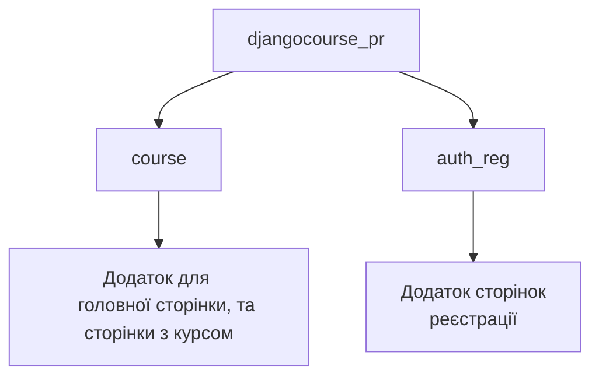

# Course Project - Проект курсу для навчання


## Опис проекту

Цей проект є курсом для навчання студентів та створенням уроків і завдань з боку вчителів. Вчителі мають зручний інтерфейс для створення модулів, уроків та завдань для учнів, а учні можуть швидко проходити створені завдання. 

Головною перевагою проекту є масштабне використання технології AJAX, завдяки чому майже всі операції — заповнення, створення, видалення та проходження завдань — виконуються швидко та без оновлення сторінок

## Встановлення та запуск
### Якщо Django встановлений
#### 1. Клонування репозиторію
```
git clone https://github.com/FeliksNovoselskyi/course-tasks-practice.git
```
#### 2. Перехід до головної директорії проекту з файлом ```manage.py```
```
cd djangocourse_pr
```
#### 3. Встановіть необхідні бібліотеки для створення завданнь
```
pip install pandas
```
```
pip install openpyxl
```
#### 4. Запуск локального серверу
Для Windows
```
python manage.py runserver
```
Для MacOS/Linux
```
python3 manage.py runserver
```

### Якщо Django НЕ встановлений
#### 1. Встановіть Django
```
pip install django
```

#### 2. Клонування репозиторію
```
git clone https://github.com/FeliksNovoselskyi/course-tasks-practice.git
```
#### 3. Перехід до головної директорії проекту з файлом ```manage.py```
```
cd djangocourse_pr
```
#### 4. Встановіть необхідні бібліотеки для створення завданнь
```
pip install pandas
```
```
pip install openpyxl
```
#### 5. Запуск локального серверу
Для Windows
```
python manage.py runserver
```
Для MacOS/Linux
```
python3 manage.py runserver
```
## !
#### Для того щоб використати можливості вчителя
1. Перейдіть на сторінку авторизації
2. Увійдіть в акаунт з іменем ```testteacher``` та паролем ```123456```
3. Перейдіть на сторінку курсу, та користуйтесь

#### Для того щоб використати можливості студента
1. Перейдіть на сторінку авторизації
2. Після цього, перейдіть на сторінку реєстрації
3. Створіть акаунт, він з самого початку буде акаунтом студента
4. Увійдіть в свій акаунт

## Сторінки проекту
- **Головна сторінка** - головна сторінка проекту з інформацією про платформу (поки що пуста сторінка)
- **Сторінка курсу** - сторінка яка надає можливість вчителям заповнювати курс модулями, уроками та завданнями, а студентам їх виконувати
- **Сторінки авторизації та реєстрації** - на цих сторінках ви можете створити свій акаунт на сайті, та увійти в нього

## Використані технології

- **[Python](https://www.python.org/)** — мова програмування, використана для створення backend частини сайту
- **[Django](https://docs.djangoproject.com/en/5.0/)** — веб-фреймворк, на якому створений проект
- **[JavaScript](https://developer.mozilla.org/en-US/docs/Web/JavaScript)** — основна мова програмування, що покращує користувацький інтерфейс
- **[jQuery](https://jquery.com/)** — бібліотека JavaScript, що спрощує розробку та користування проектом
- **[Sortable](https://jqueryui.com/sortable/)** — плагін jQuery для зручного сортування уроків та модулів, а також зміни їхньої послідовності
- **[AJAX](https://api.jquery.com/category/ajax/)** — технологія для швидкої та зручної роботи з даними без оновлення сторінок
- **[HTML](https://developer.mozilla.org/en-US/docs/Web/HTML)/[CSS](https://developer.mozilla.org/en-US/docs/Learn/CSS)** — мови для верстки сайту, створення його структури та стилів
- **[Bootstrap 5](https://getbootstrap.com/)** — фронтенд-фреймворк для створення деяких елементів на сторінках
- **[Figma](https://help.figma.com/hc/en-us)** — онлайн-сервіс, використаний для планування дизайну сайту

## Структура проекту
