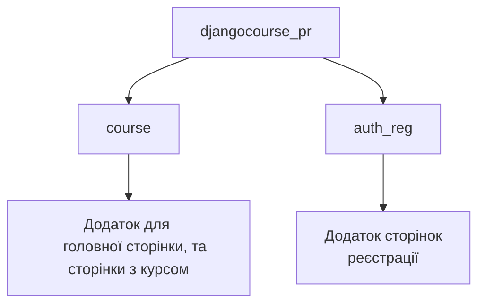

# Course Project - Проект курсу для навчання

## Опис проекту

Цей проект є курсом для навчання студентів та створенням уроків і завдань з боку вчителів. Вчителі мають зручний інтерфейс для створення модулів, уроків та завдань для учнів, а учні можуть швидко проходити створені завдання. 

Головною перевагою проекту є масштабне використання технології AJAX, завдяки чому майже всі операції — заповнення, створення, видалення та проходження завдань — виконуються швидко та без оновлення сторінок.

## Використані технології

- **[Python](https://www.python.org/)** — мова програмування, використана для створення backend частини сайту.
- **[Django](https://docs.djangoproject.com/en/5.0/)** — веб-фреймворк, на якому створений проект.
- **[JavaScript](https://developer.mozilla.org/en-US/docs/Web/JavaScript)** — основна мова програмування, що покращує користувацький інтерфейс.
- **[jQuery](https://jquery.com/)** — бібліотека JavaScript, що спрощує розробку та користування проектом.
- **[Sortable](https://jqueryui.com/sortable/)** — плагін jQuery для зручного сортування уроків та модулів, а також зміни їхньої послідовності.
- **[AJAX](https://api.jquery.com/category/ajax/)** — технологія для швидкої та зручної роботи з даними без оновлення сторінок.
- **[HTML](https://developer.mozilla.org/en-US/docs/Web/HTML)/[CSS](https://developer.mozilla.org/en-US/docs/Learn/CSS)** — мови для верстки сайту, створення його структури та стилів.
- **[Bootstrap 5](https://getbootstrap.com/)** — фронтенд-фреймворк для створення деяких елементів на сторінках.

## Структура проекту
