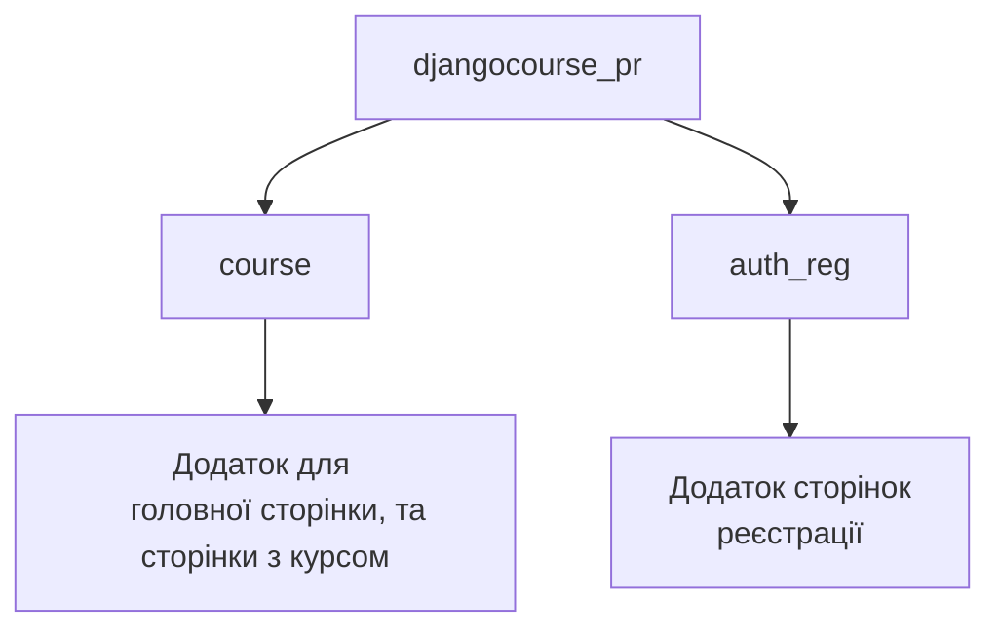

# Course Project - Проект курсу для навчання


## Опис проекту

Цей проект є курсом для навчання студентів та створенням уроків і завдань з боку вчителів. Вчителі мають зручний інтерфейс для створення модулів, уроків та завдань для учнів, а учні можуть швидко проходити створені завдання. 

Головною перевагою проекту є масштабне використання технології AJAX, завдяки чому майже всі операції — заповнення, створення, видалення та проходження завдань — виконуються швидко та без оновлення сторінок

## Встановлення та запуск
### Якщо Django встановлений
#### 1. Клонування репозиторію
```
git clone https://github.com/FeliksNovoselskyi/course-tasks-practice.git
```
#### 2. Перехід до головної директорії проекту з файлом ```manage.py```
```
cd djangocourse_pr
```
#### 3. Встановіть необхідні бібліотеки для створення завданнь
```
pip install pandas
```
```
pip install openpyxl
```
#### 4. Запуск локального серверу
Для Windows
```
python manage.py runserver
```
Для MacOS/Linux
```
python3 manage.py runserver
```

### Якщо Django НЕ встановлений
#### 1. Встановіть Django
```
pip install django
```

#### 2. Клонування репозиторію
```
git clone https://github.com/FeliksNovoselskyi/course-tasks-practice.git
```
#### 3. Перехід до головної директорії проекту з файлом ```manage.py```
```
cd djangocourse_pr
```
#### 4. Встановіть необхідні бібліотеки для створення завданнь
```
pip install pandas
```
```
pip install openpyxl
```
#### 5. Запуск локального серверу
Для Windows
```
python manage.py runserver
```
Для MacOS/Linux
```
python3 manage.py runserver
```
## !
#### Для того щоб використати можливості вчителя
1. Перейдіть на сторінку авторизації
2. Увійдіть в акаунт з іменем ```testteacher``` та паролем ```123456```
3. Перейдіть на сторінку курсу, та користуйтесь

#### Для того щоб використати можливості студента
1. Перейдіть на сторінку авторизації
2. Після цього, перейдіть на сторінку реєстрації
3. Створіть акаунт, він з самого початку буде акаунтом студента
4. Увійдіть в свій акаунт

## Сторінки проекту
- **Головна сторінка** - головна сторінка проекту з інформацією про платформу (поки що пуста сторінка)
- **Сторінка курсу** - сторінка яка надає можливість вчителям заповнювати курс модулями, уроками та завданнями, а студентам їх виконувати
- **Сторінки авторизації та реєстрації** - на цих сторінках ви можете створити свій акаунт на сайті, та увійти в нього

## Використані технології

- **[Python](https://www.python.org/)** — мова програмування, використана для створення backend частини сайту
- **[Django](https://docs.djangoproject.com/en/5.0/)** — веб-фреймворк, на якому створений проект
- **[JavaScript](https://developer.mozilla.org/en-US/docs/Web/JavaScript)** — основна мова програмування, що покращує користувацький інтерфейс
- **[jQuery](https://jquery.com/)** — бібліотека JavaScript, що спрощує розробку та користування проектом
- **[Sortable](https://jqueryui.com/sortable/)** — плагін jQuery для зручного сортування уроків та модулів, а також зміни їхньої послідовності
- **[AJAX](https://api.jquery.com/category/ajax/)** — технологія для швидкої та зручної роботи з даними без оновлення сторінок
- **[HTML](https://developer.mozilla.org/en-US/docs/Web/HTML)/[CSS](https://developer.mozilla.org/en-US/docs/Learn/CSS)** — мови для верстки сайту, створення його структури та стилів
- **[Bootstrap 5](https://getbootstrap.com/)** — фронтенд-фреймворк для створення деяких елементів на сторінках
- **[Figma](https://help.figma.com/hc/en-us)** — онлайн-сервіс, використаний для планування дизайну сайту

## Структура проекту


## Функціонал проекту
### BACKEND
#### Файл djangocourse_pr/course/views.py
```python
from django.shortcuts import render, get_object_or_404
from django.template.loader import render_to_string
from django.http import JsonResponse

from django.urls import reverse
from .models import *
from auth_reg.models import *

import pandas
import utils

# Create your views here.
def main_view(request):
    context = {}
    
    utils.check_user_authentication(request, context)
        
    return render(request, 'course/main.html', context)

# Для страницы курса со всеми модулями, уроками и заданиями
def course_view(request):
    context = {}
    
    context['user_status'] = utils.check_status(request_user=UserProfile.objects.get(user=request.user))
    utils.check_user_authentication(request, context)
    
    # _candelete добавлено в название чтобы отличить от другой переменной all_lessons
    all_lessons_candelete = Lesson.objects.all()
    all_tasks = Task.objects.all().values_list('lesson_id', flat=True)

    lesson_ids_with_tasks = set(all_tasks)

    for lesson in all_lessons_candelete:
        if lesson.id in lesson_ids_with_tasks:
            # Если для урока есть задания, запрещаем удаление
            if lesson.can_delete:
                lesson.can_delete = False
                lesson.save()
        else:
            # Если для урока нет заданий, разрешаем удаление
            if not lesson.can_delete:
                lesson.can_delete = True
                lesson.save()
        
    if request.method == 'POST':
        # Если был выбран модуль
        if 'filter_by_module' in request.POST:
            module_id = request.POST.get('module_id')
            lessons_with_tasks = []
            lessons = Lesson.objects.filter(module_id=module_id).order_by('order')
            
            for lesson in lessons:
                tasks = Task.objects.filter(lesson=lesson)
                lessons_with_tasks.append({
                    'lesson': lesson,
                    'tasks': tasks,
                })

            # Получаем шаблон, в котором находятся уроки из выбранного модуля, для передачи его
            # в ajax, а потом и на саму страницу
            lessons_html = render_to_string('course/lessons_partial.html', {
                'lessons_with_tasks': lessons_with_tasks,
                'user_status': utils.check_status(request_user=UserProfile.objects.get(user=request.user)),
            }, request=request)
            
            # Отображаем в меню выбора уроков для создания задания
            # только те уроки, которые находятся в модуле выбранном пользователем
            dropdown_lessons_html = render_to_string('course/lesson_dropdown_for_tasks.html', {
                'lessons_with_tasks': lessons_with_tasks,
            }, request=request)
            
            return JsonResponse({
                'lessons_html': lessons_html,
                'dropdown_lessons': dropdown_lessons_html,
            })
        
        # Если происходит смена порядка элементов на странице с помощью библиотеки Sortable
        # (уроки либо модули)
        if 'cell_order' in request.POST:
            sortable_obj_type = request.POST['sortable_obj_type']
            
            if sortable_obj_type == 'lesson':
                utils.cell_order(cell_model=Lesson, cell_order_from_request=request.POST['cell_order'])
            if sortable_obj_type == 'module':
                utils.cell_order(cell_model=Module, cell_order_from_request=request.POST['cell_order'])
                
        # Если от ajax-а пришло что пользователь добавляет задание
        if 'add_task' in request.POST:
            task_name = request.POST.get('taskname')
            task_file = request.FILES.get('taskfile')
            additional_words_file = request.FILES.get('additional_words_file')
            selected_lesson_value = request.POST.get('selected_lesson_value')
            
            if task_name and task_file and additional_words_file and selected_lesson_value:
                sentences = pandas.read_excel(task_file)
                additional_words = pandas.read_excel(additional_words_file)
                
                english_sentences = []
                ukrainian_sentences = []
                additional_words_list = []

                for row in sentences.itertuples(index=False):
                    column1_value = row[0] # английское предложение
                    column2_value = row[1] # украинское предложение
                    
                    # Подготавливаем предложения и списки с ними для загрузки в модель при создании урока
                    cleaned_value_column1 = column1_value.strip()
                    lines_column1 = cleaned_value_column1.split('\n')
                    cleaned_value_column2 = column2_value.strip()
                    lines_column2 = cleaned_value_column2.split('\n')

                    lines_eng = []
                    lines_ukr = []

                    for line in lines_column1:
                        stripped_line = line.strip()
                        if stripped_line:
                            lines_eng.append(stripped_line)
                            
                    for line in lines_column2:
                        stripped_line = line.strip()
                        if stripped_line:
                            lines_ukr.append(stripped_line)

                    if lines_eng and lines_ukr:
                        english_sentences.extend(lines_eng)
                        ukrainian_sentences.extend(lines_ukr)

                for row in additional_words.itertuples(index=False):
                    word_value = row[0]
                    
                    cleaned_word_value = word_value.strip()
                    lines_words = cleaned_word_value.split('\n')
                    
                    lines_word_final = []
                    
                    for line in lines_words:
                        stripped_line = line.strip()
                        if stripped_line:
                            lines_word_final.append(stripped_line)
                    
                    if lines_word_final:
                        additional_words_list.extend(lines_word_final)
                
                selected_lesson = Lesson.objects.get(id=selected_lesson_value)
                selected_lesson.can_delete = False
                selected_lesson.save()
                
                task = Task.objects.create(
                    lesson = selected_lesson,
                    task_name = task_name,
                    english_sentences = english_sentences,
                    ukrainian_sentences = ukrainian_sentences,
                    additional_words = additional_words_list,
                )
                
                task_url = reverse('task_detail', args=[task.id])
                
                task_html = render_to_string('course/task_block.html', {
                    'task': task,
                    'module_id': selected_lesson.module_id,
                    'lesson_id': selected_lesson_value,
                    'task_url': task_url,
                    'user_status': utils.check_status(request_user=UserProfile.objects.get(user=request.user)),
                }, request=request)
        
                return JsonResponse({
                    'addName': True,
                    'canDeleteLesson': False,
                    'error': '',
                    'task_html': task_html,
                })
            else:
                return JsonResponse({'error': 'Заповніть усі поля'})
        
        if 'delete_task' in request.POST:
            # Получаем из ajax id задания которое нужно удалить
            task_id = request.POST.get('task_id')
            lesson_id = request.POST.get('lesson_id')
            
            try:
                # Получаем его из бд и удаляем на стороне сервера
                task = Task.objects.get(id=task_id)
                task.delete()
                
                remaining_tasks = Task.objects.filter(lesson_id=lesson_id).exists()
                
                if not remaining_tasks:
                    lesson = Lesson.objects.get(id=lesson_id)
                    lesson.can_delete = True
                    lesson.save()

                # Отправляем ajax-у, что можно удалять задание на стороне клиента
                return JsonResponse({'deleteTask': True, 'canDeleteLesson': not remaining_tasks})
            # На крайняк, если задания каким-то образом не будет
            except Task.DoesNotExist:
                return JsonResponse({'success': False, 'error': 'Завдання не знайдено'})
            
        if 'add_lesson' in request.POST:
            lesson_name = request.POST.get('lessonname')
            module_id = request.POST.get('module_id')
            
            if lesson_name and module_id:
                try:
                    module = Module.objects.get(id=module_id)
                except Module.DoesNotExist:
                    return JsonResponse({'error': 'Выбранный модуль не существует'})
                
                lesson = Lesson.objects.create(lesson_name=lesson_name, module=module)
                lesson_id = lesson.id
                
                lesson_html = render_to_string('course/lesson_block.html', {
                    'lesson': lesson,
                    'user_status': utils.check_status(request_user=UserProfile.objects.get(user=request.user)),  
                }, request=request)
                
                return JsonResponse({
                    'addLesson': True,
                    'lessonId': lesson_id,
                    'lessonName': lesson_name,
                    'lesson_html': lesson_html,
                })
            else:
                return JsonResponse({'error': 'Заповніть поле з назвою уроку'})
        
        if 'delete_lesson' in request.POST:
            lesson_id = request.POST.get('lesson_id')
            try:
                lesson = Lesson.objects.get(id=lesson_id)
                lesson.delete()
                return JsonResponse({'deleteLesson': True})
            except Lesson.DoesNotExist:
                return JsonResponse({'success': False, 'error': 'Урок не знайдений'})
        
        if 'add_module' in request.POST:
            module_name = request.POST.get('modulename')
            course_id = request.POST.get('course_id')
            
            if module_name and course_id:
                course = Course.objects.get(id=course_id)
                module = Module.objects.create(course=course, module_name=module_name)
                module_id = module.id
                
                module_html = render_to_string('course/module_block.html', {
                    'module': module,
                    'user_status': utils.check_status(request_user=UserProfile.objects.get(user=request.user)),
                }, request=request)
                
                return JsonResponse({
                    'addModule': True,
                    'moduleId': module_id,
                    'moduleName': module_name,
                    'module_html': module_html,
                })
            else:
                return JsonResponse({'error': 'Заповніть поле з назвою модулю'})
        if 'delete_module' in request.POST:
            module_id = request.POST.get('module_id')
            
            try:
                module = Module.objects.get(id=module_id)
                module.delete()
                return JsonResponse({'deleteModule': True})
            except Module.DoesNotExist:
                return JsonResponse({'success': False, 'error': 'Модуль не знайдений'})
            
    all_lessons = Lesson.objects.all().order_by('order')
    lessons_with_tasks = []
    
    for lesson in all_lessons:
        tasks = Task.objects.filter(lesson=lesson)
        lessons_with_tasks.append({
            'lesson': lesson,
            'tasks': tasks,
        })
        
    courses = Course.objects.all()
    modules = Module.objects.all().order_by('order')
    context['courses'] = courses
    context['modules'] = modules
    context['lessons_with_tasks'] = lessons_with_tasks
    
    current_module_id = request.GET.get('module_id', None)
    context['current_module_id'] = current_module_id
    
    return render(request, 'course/course.html', context)

# Для страницы каждого задания
def task_detail_view(request, task_id):
    context = {}
    
    utils.check_user_authentication(request, context)
        
    task = get_object_or_404(Task, id=task_id)
    
    english_sentences = task.english_sentences
    ukrainian_sentences = task.ukrainian_sentences
    additional_words = task.additional_words
    
    if request.method == 'POST':
        # Получаем задание на котором находимся из ajax
        current_index = int(request.POST.get('current_index', 0))

        # Если не достигли конца списка предложений, передаем индекс следующего предложения
        if current_index < len(english_sentences) - 1:
            next_english_sentence = english_sentences[current_index + 1]
            next_ukrainian_sentence = ukrainian_sentences[current_index + 1]
            
            response_data = {
                'english_sentence': next_english_sentence,
                'ukrainian_sentence': next_ukrainian_sentence,
                'next_index': current_index + 1,
                'additional_words': additional_words,
            }
        else:
            response_data = {'error': True}

        return JsonResponse(response_data)

    # Получаем первое предложение в задании
    first_english_sentence = english_sentences[0]
    first_ukrainian_sentence = ukrainian_sentences[0]
    context['task'] = task
    context['first_english_sentence'] = first_english_sentence  # Передаем первое предложение на английском
    context['first_ukrainian_sentence'] = first_ukrainian_sentence  # Передаем первое предложение на украинском
    context['sentences_len'] = range(1, len(english_sentences) + 1)  # Передаем количество предложений
    context['additional_words_first'] = additional_words  # Передаем дополнительные слова для первого предложения
    
    return render(request, 'course/task_detail.html', context)
```
Цей файл забезпечує відображення головної сторінки, курса, та сторінки кожного завдання
У функціях для сторінки курсу та кожного завдання обробляються AJAX запроси, та зберігається потрібна інформація у БД

У функції course_view() обробляються:
- Створення модулів
- Видалення модулів
- Зміна розташування модулів, та збереження їх порядку
- Створення уроків
- Видалення уроків
- Зміна розташування уроків, та збереження їх порядку
- Створення завдань, та парсинг таблиці Excel з його реченнями
- Видалення видалення
- Завантаження потрібних уроків на сторінці після обирання модуля

У функції task_detail_view() обробляються:
- Завантажуються речення з бази даних та відправляються до шаблону
- Завантажуються додаткові слова для збору реченнь
- Вираховується індекс наступного речення

#### Файл djangocourse_pr/auth_reg/views.py
```python
from django.shortcuts import render, redirect
from django.contrib.auth import authenticate, login, logout
from django.contrib.auth.models import User
from django.db.utils import IntegrityError
from auth_reg.models import *
import utils

# Create your views here.
# Функция обработки авторизации
def auth_view(request):
    context = {}
    
    utils.check_user_authentication(request, context)
    
    if 'submit_btn' in request.POST:
        # Проверка, если пользователь уже вошел в аккаунт при попытке входа
        if request.user.is_authenticated:
            context['error'] = 'Вы уже вошли в аккаунт'
        else:
            username = request.POST.get('username_inp')
            password = request.POST.get('password_inp')
            
            if username and password:
                user = authenticate(username=username, password=password)
                
                if user:
                    login(request, user)
                    return redirect('auth')
                else:
                    context["error_message"] = 'Логін або пароль не вірні'
            else:
                context['error_message'] = 'Заповніть усі поля'
    if 'leave_btn' in request.POST:
        logout(request)
        return redirect('auth')
    return render(request, 'auth_reg/auth.html', context)

# Функция обработки регистрации
def reg_view(request):
    context = {}
    
    utils.check_user_authentication(request, context)
        
    if request.method == 'POST':
        username = request.POST.get('username_inp')
        password = request.POST.get('password_inp')
        confirm_password = request.POST.get('conf_password_inp')
    
        if username and password and confirm_password:
            if password == confirm_password:
                # Проверка наличия такого пользователя
                try:
                    # Создание пользователя
                    user = User.objects.create_user(
                        username=username,
                        password=password,
                    )
                    
                    # Создание профиля пользователя
                    UserProfile.objects.create(user=user)
                    
                    return redirect('auth')
                except IntegrityError:
                    context["error"] = 'Такий користувач вже існує'
            else:
                context['error_message'] = 'Паролі не співпадають'    
        else:
            context['error_message'] = 'Заповніть усі поля'
    return render(request, 'auth_reg/reg.html', context)
```
У цьому файлі проходить відображення сторінок авторизації та реєстрації
Також тут виконується функціонал авторизації та реєстрації